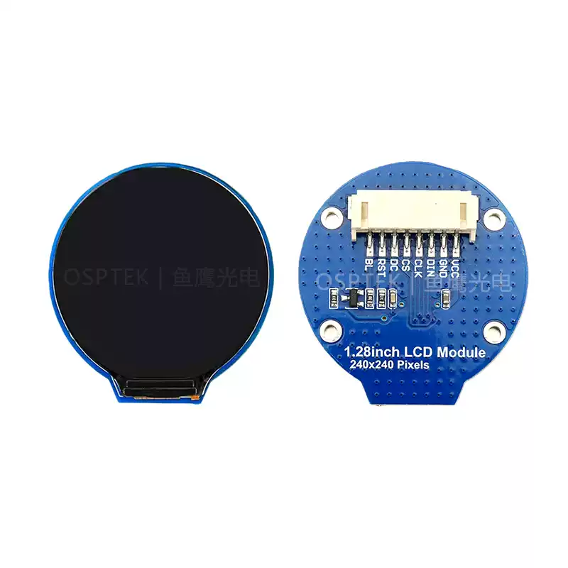

<h1 align="center">OSPTEK 1.28″ TFT 240×240（GC9A01 · SPI）</h1>

<b>TFT 模组 · SPI · GC9A01 · 多版本索引</b>

<a href="./README_EN.md">English</a> | 简体中文

  
  
  
  

## 目录

- [说明](#说明)
- [版本一览](#版本一览)
- [YDP128HB001-P8](#ydp128hb001-p8)
- [YDP128H010-V2](#ydp128h010-v2)
- [如何切换分支](#如何切换分支)
- [购买链接](#购买链接)
- [技术支持](#技术支持)

---

## 说明

本仓库收录 **1.28 寸 240×240 TFT（SPI · GC9A01）** 显示模组资料。

**`main` 为导航页**（仓库默认分支）。下表可快速浏览各版本；点击「说明」跳转到本页下方的详细介绍。需要某一版本的完整内容时，请切换到对应**版本分支**（方法见下文）。

规格标识（仓库名）：`1.28-tft-240x240-spi-gc9a01`

---

## 版本一览

| 版本 | 宣传图 | 说明 |
| ---- | ------ | ---- |
| YDP128HB001-P8 |  | [查看详情](#ydp128hb001-p8) |
| YDP128H010-V2 |  | [查看详情](#ydp128h010-v2) |

---

## YDP128HB001-P8

---

## YDP128H010-V2

---

## 如何切换分支

完整产品资料在各**版本分支**中；`main` 仅作导航。

- **网页：** 在仓库页左上角打开分支下拉框，选择与料号对应的版本分支即可。
- **命令行：** 克隆本仓库后执行 `git checkout <版本分支名>`；若本地已有仓库，先 `git fetch` 再切换。

---

## 购买链接

  
  &nbsp;&nbsp;
  

**国内（淘宝）**

- 店铺：[鱼鹰光电工厂店](https://shop110742373.taobao.com/)

**海外（AliExpress）**

- 店铺：[OSPTEK Official Store](https://www.aliexpress.com/store/1105701619)

---

## 技术支持

- 技术支持 / 产品咨询：<luyu@osptek.com>
- QQ 技术交流群：**985881096**
- 公司官网：<https://osptek.com/>
- 有任何问题，都可以在本仓库 Issues 中提问

---

© 2026 OSPTEK 鱼鹰光电 · 本仓库资料采用 CC BY 4.0 许可

