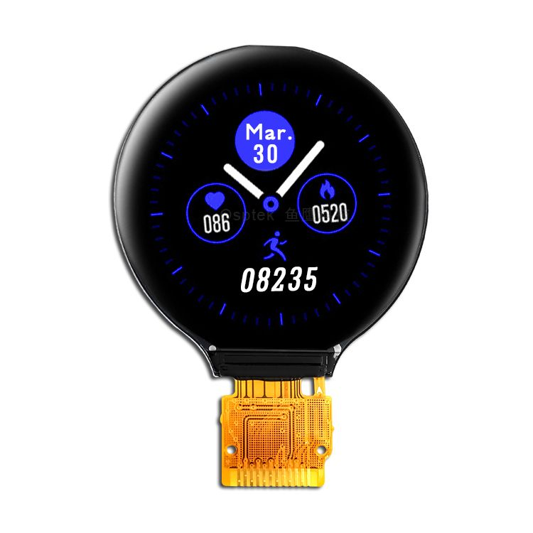

<p align="left"></p>

<h1 align="center">OSPTEK 1.28″ TFT 240×240（GC9A01 · SPI）</h1>

<p align="center"><b>圆形 TFT 模组 · SPI · GC9A01</b></p>

<p align="center"><a href="./README_EN.md">English</a> | 简体中文 · <a href="../../README.md">规格族索引</a></p>

<p align="center">
  
  
  
  
</p>

<p align="center"></p>

## 目录

- [产品简介](#产品简介)
- [规格参数](#规格参数)
- [示例工程](#示例工程)
- [仓库结构](#仓库结构)
- [相关资料](#相关资料)
- [购买链接](#购买链接)
- [技术支持](#技术支持)

---

## 产品简介

OSPTEK **1.28 寸 240×240 TFT** 是一款 **SPI** 接口彩色圆形显示模组，显示驱动为 **GC9A01**。适合穿戴表盘、圆形仪表与小型圆形 HMI 等场景。

规格标识（仓库名）：`1.28-tft-240x240-spi-gc9a01`

当前屏幕版本：**YDP128H010-V2**。电气与外形细节以 [`docs/YDP128H010-V2.pdf`](./docs/YDP128H010-V2.pdf) 为准。

## 规格参数

| 项目 | 规格 |
| ---- | ---- |
| 尺寸 | 1.28 英寸 |
| 类型 | TFT（彩色，圆形） |
| 分辨率 | 240×240 |
| 接口 | SPI |
| 驱动 IC | GC9A01 |

> 完整外形尺寸、FPC 定义、供电与时序以产品规格书 / 驱动手册为准。

## 示例工程

| 说明 | 路径 |
| ---- | ---- |
| ESP32-S3 · GC9A01 SPI + LVGL9（圆形 UI 动画演示） | [`examples/esp32s3-1.28-tft-240x240-spi-gc9a01-bringup/`](./examples/esp32s3-1.28-tft-240x240-spi-gc9a01-bringup/) |

## 仓库结构

```text
1.28-tft-240x240-spi-gc9a01/                                # 仓库根（导航见 ../../README.md）
└── versions/
    └── YDP128H010-V2/                                # 本料号完整资料
        ├── README.md
        ├── README_EN.md
        ├── images/
        ├── docs/
        └── examples/
```

## 相关资料

### 本产品资料

| 资料 | 链接 |
| ---- | ---- |
| 屏幕规格书（YDP128H010-V2） | [`docs/YDP128H010-V2.pdf`](./docs/YDP128H010-V2.pdf) |
| 驱动 IC 数据手册（GC9A01） | [`docs/LCD_DST_3015_GC_9_A01_Data_Sheet_V1_0_Preliminary_2_35d4b172aa.pdf`](./docs/LCD_DST_3015_GC_9_A01_Data_Sheet_V1_0_Preliminary_2_35d4b172aa.pdf) |
| 初始化序列（文本） | [`docs/HSD1.28+GC9A01 initial code 20191231 优美K15.txt`](./docs/HSD1.28+GC9A01%20initial%20code%2020191231%20%E4%BC%98%E7%BE%8EK15.txt) |

### 示例工程

- [ESP32-S3 GC9A01 SPI + LVGL9](./examples/esp32s3-1.28-tft-240x240-spi-gc9a01-bringup/)

## 购买链接

<p align="center">
  <a href="https://shop110742373.taobao.com/"></a>
  &nbsp;&nbsp;
  <a href="https://www.aliexpress.com/store/1105701619"></a>
</p>

**国内（淘宝）**

- 店铺：[鱼鹰光电工厂店](https://shop110742373.taobao.com/)

**海外（AliExpress）**

- 店铺：[OSPTEK Official Store](https://www.aliexpress.com/store/1105701619)

## 技术支持

- 技术支持 / 产品咨询：<luyu@osptek.com>
- QQ 技术交流群：**985881096**
- 公司官网：<https://osptek.com/>
- 有任何问题，都可以在本仓库 Issues 中提问

---

<p align="center"><sub>© 2026 OSPTEK 鱼鹰光电 · 本仓库资料采用 CC BY 4.0 许可</sub></p>
